# Ksak: A High-throughput Tool for Alignment-free Phylogenetics

# README

## Introduction

Phylogenetic analysis is the cornerstone of evolutionary biology and taxonomy. Phylogeny based on molecular sequence similarity has become the de facto standard. All subsequences of size k derived from a molecular sequence are called its k-mers. Numerous studies demonstrated that k-mers of molecular sequences, such as genomic DNA and proteins are conserved within closely related organisms, and diverge with speciation. Thus k-mer statistics are efficient and effective phylogenetic distance measures.

As shown in the Fig. 1, we developed Ksak - a tool that not only efficiently computes seven widely accepted k-mer statistics: Chebyshev (Ch), Manhattan (Ma), Euclidian (Eu), Hao, d2, d2S and d2star, but also performs alignment-free phylogenetic analysis. By applying it to the golden standard 16S rRNA dataset, we extensively benchmarked the accuracy and efficiency of Ksak by comparing to other popular phylogenetic analysis tools：Muscle, ClustalW2, Mafft and Cafe. We made the software of Ksak open source. Ksak runs on MS Windows operating systems with a graphical user interface.

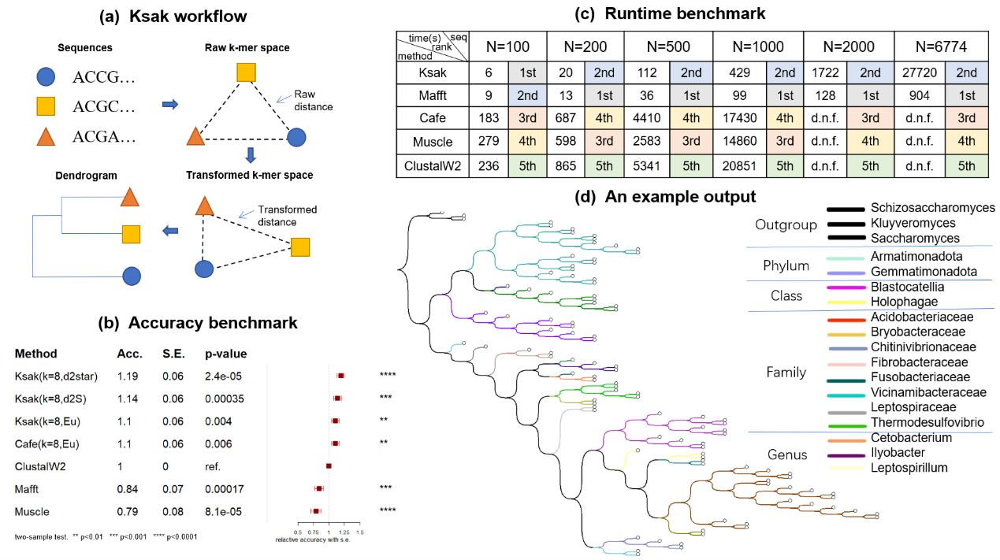

Fig. 1 (a) The computation framework of <i>Ksak</i>; (b) Accuracy benchmark results; (c) Efficiency benchmark results; (d) An example phylogeny tree output of <i>Ksak</i>.

***
## Install

### 1. Where can I get <i>Ksak</i>?

You need to clone or download this project, then locate to <b>[bin/Release]</b>. After double-clicking <i><b>Ksak.exe</b></i>, you'll see the program graphical interface immediately.

### 2. Where can I get the example data?
   
We have provided some example fasta formatted data in the directory <b>[data]</b>, you can get the input sequence data in <b>[sequences]</b> and the outgroup data in  the directory <b>[outgroup]</b>. Use these data as template to construct your own data.

### 3. How to use <i><b>Ksak.exe</b></i> to analyze the example data?
   
① Double-click to run <i>Ksak.exe</i> in [bin/Release];

② Click <i>Add</i> button in <i>Input</i> panel, then pick the sequences in [data/sequences] (Hold <i>Shift</i> key to multi-select);

③ Click <i>Inputs/Add Outgroup</i> in the main menu, then pick the sequences in [data/outgroup];

④ Check <i>Eu</i> (or some other measures if you like) in the <i>Configuraion panel</i>, and modify the <i>K-mer length</i> and <i>Markov Background Order</i> (optional), then click the <i>Run</i> button;

⑤ The results will appeared in the <i>Output</i> panel.

***
## Manual (Windows)

## 1. The user interface of <i>Ksak</i>

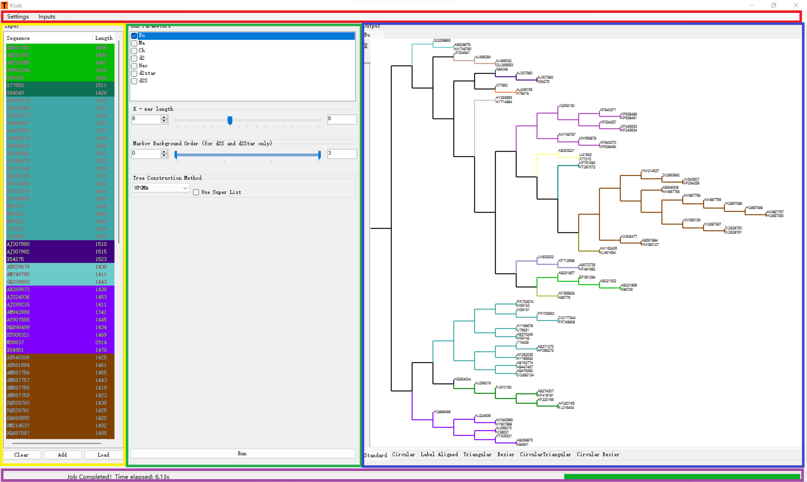

Fig. 2 The user interface of <i>Ksak</i> is shown below.

### 1.1. Main menu

As shown in the Fig. 2, the red area is the <b>main menu</b>, where you can set the language, graphic font and other options. The yellow area is the input sequences, where you can view and edit the sequences with highlight colors. The green area is the <b>configuration panel</b>, where you can configure the options of clustering and plotting algorithm, etc. The blue area is the <b>output panel</b>, where you can view and export the generated trees. The purple area is the <b>status bar</b>, where the current progress of calculation and plotting is displayed.

### 1.2. Configuration panel

This panel is used to configure the calculation parameters. In the <i><u>Distance</u></i> multiple selector you can configure the distance algorithm which is needed for the calculation. In the <i><u>k-string length</u></i> field you can configure the interval information for k-string length. In the <i><u>Markov model</u></i> field you can configure the interval information for Markov model. In the <i><u>Tree Constrcution Method</u></i> field you can configure the clustering algorithm (Unweighted pair-group method with arithmetic means (UPGMA) or Neighbor Joining (NJ)).

### 1.3. Status bar

After importing and configuring the input sequences, you can click the <i><u>Generate</u></i> button to start running the software. The running progress can be viewed in this area.

### 1.4. Output panel

After the calculation is complete, the obtained tree is presented on the <i><u>Output panel</u></i>. We can select to review different styles of output trees (Standard and Circular). Meanwhile, by right clicking on the output display area you can choose <i><u>Save</u></i> or <i><u>Save All ...</u></i> to save the results to bmp image, tree description file or distance matrix. Double-click the output display area, outputs can be reviewed separately in a pop-up box.

In the example run, we input the comparison sequences in the <i><u>Iutput sequences</u></i> and run <i>Ksak</i> and obtain the output evolutionary tree directly.

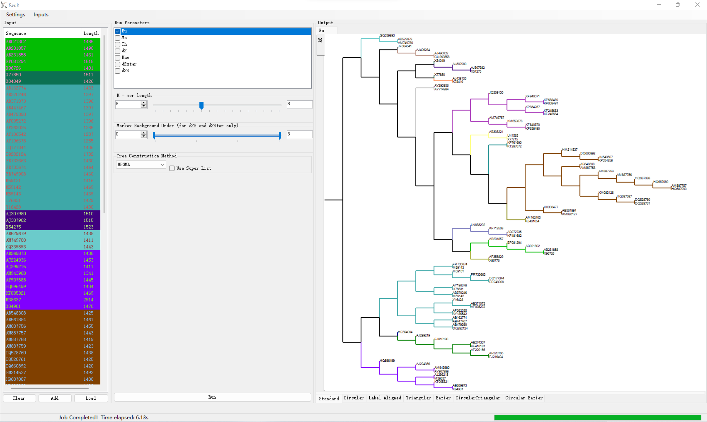

Fig. 3 An example run of <i>Ksak</i>.

## 2. Advanced features of <i>Ksak</i>

<i>Ksak</i> has multi-window view: Multiple windows can be opened for easy comparison from tree to tree; <i>Ksak</i> allows users to produce plots, mark colors, and set fonts with one click; <i>Ksak</i> supports Chinese & English languages.

<i>Ksak</i>'s graphical interface is roughly divided into three panels. The left column is used to input sequences. One can clear the input sequence by clicking the Clear button. Import the sequence file by opening the input dialog box as shown in the figure by clicking the <i><u>Add</u></i> button. As shown in the Fig. 4, meanwhile, the <i><u>Input</u></i> box supports file/folder drag-and-drop operation and will automatically apply the fasta format file in the folder to import. Double-click the sequence file name you can review the sequence information.

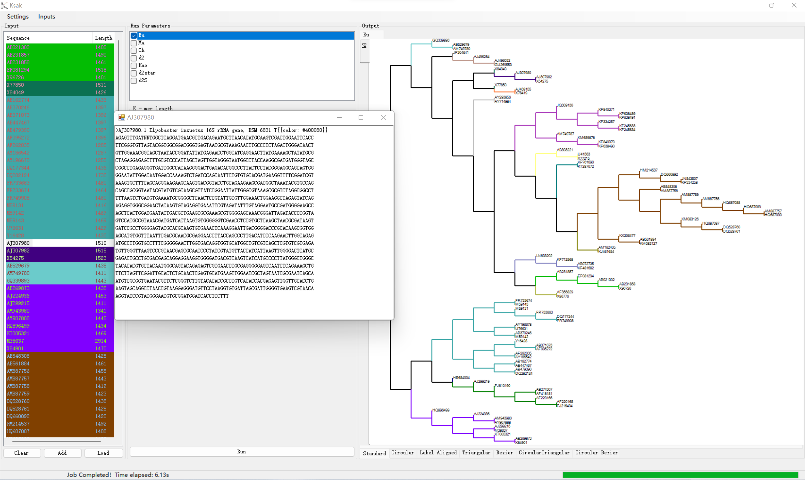

Fig. 4 Import sequences to <i>Ksak</i>.

&nbsp;

In addition, right click on the sequence name in the shortcut menu, you can mark the sequence with selected color. In this way, the sequences are color-categorized before comparison, and the output evolution tree is very clear.

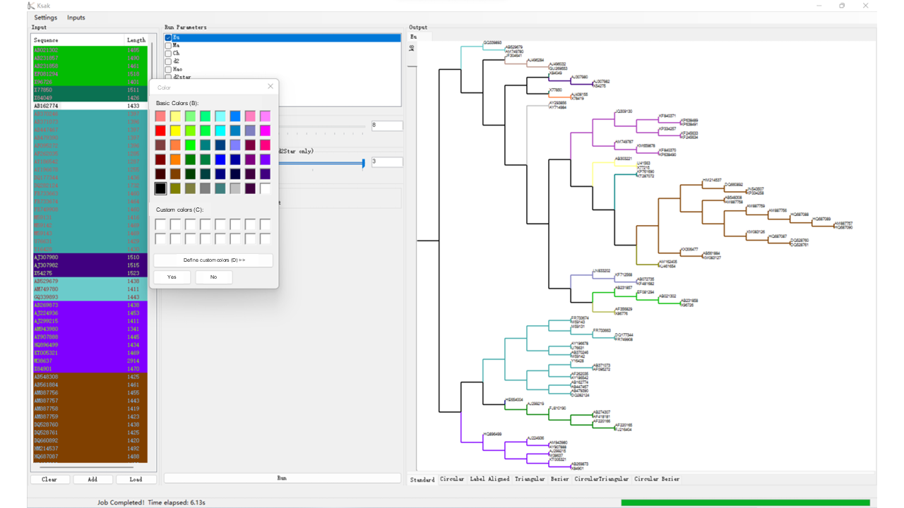

Fig. 5 Color setting of <i>Ksak</i>.

&nbsp;

- <i>Ksak</i> can output two types of clustering tree, including UPGMA clustering and NJ clustering. The following figures show the output results of them.

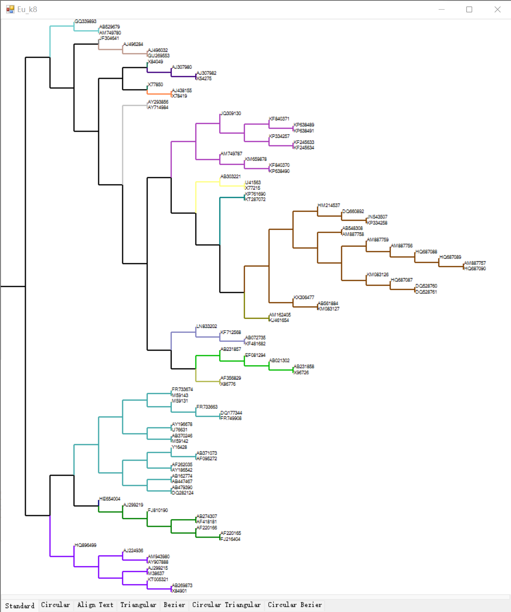

Fig. 6 UPGMA clustering

&nbsp;

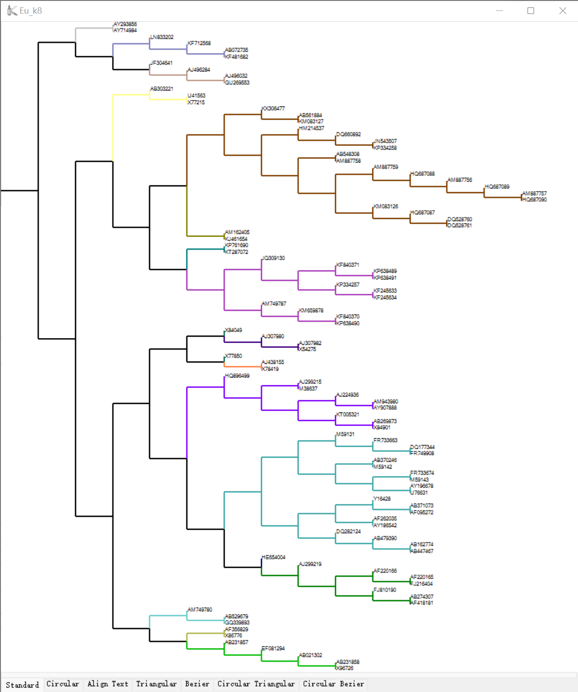

Fig. 7 NJ clustering

&nbsp;

- The output of <i>Ksak</i> can be saved in three ways. The first way is in image form, and you can output all the plots from all parameters at once and save them in a folder. The second way is in matrix form, where all the plots from all parameters are saved in matrix form, stored in the same folder, and saved in the parameter format. The third way is in notepad form, where all sequences are output in the format described under different parameters. These three ways are shown in the figures.

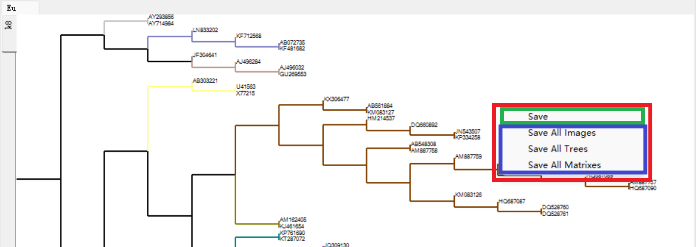

Fig. 8 Three output ways of <i>Ksak</i>.

&nbsp;

- For the output results in the form of evolution trees, we can upgrade the output to the following 7 presentation forms. The evolution tree allows us to visualize the different clustering effects and the clustering effect of species.

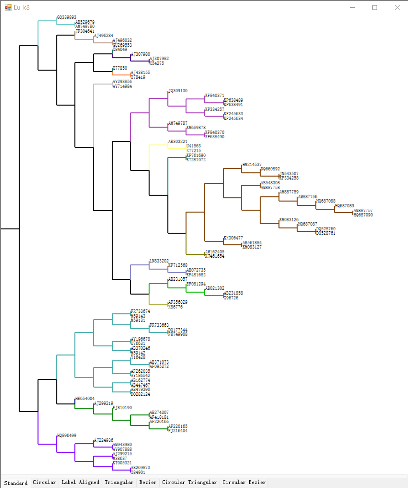

Fig. 9 Standard form.

&nbsp;

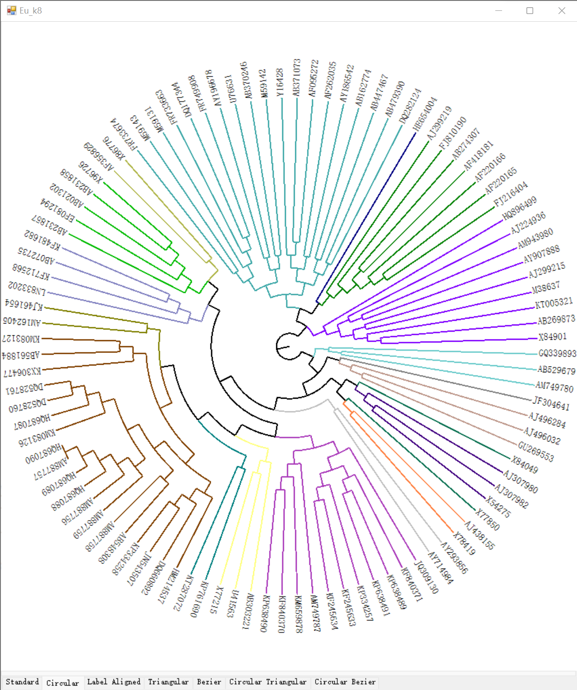

Fig. 10 Circular form.

&nbsp;

Fig. 11 Align text form.

&nbsp;

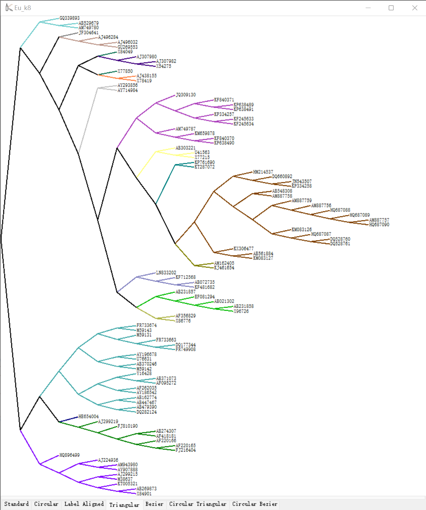

Fig. 12 Triangular form.

&nbsp;

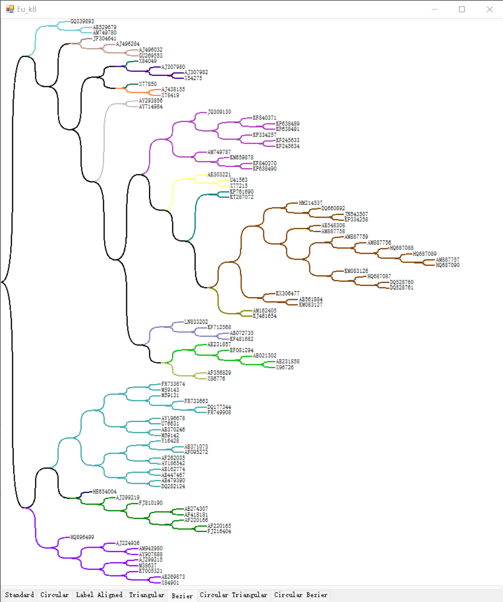

Fig. 13 Bezier form.

&nbsp;

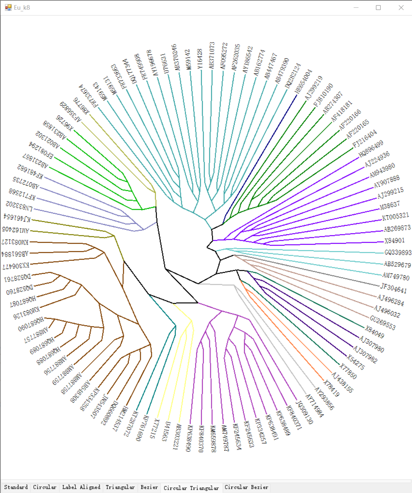

Fig. 14 Circular triangular form.

&nbsp;

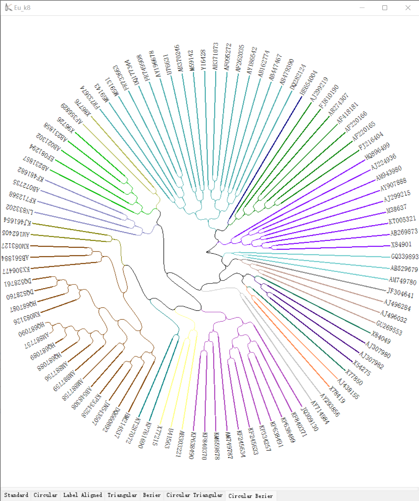

Fig. 15 Circular bezier form.

## References:

Liu, X. M., Wan, L., et al. (2011) New powerful statistics for alignment-free sequence comparison under a pattern transfer model. J. Theor. Biol, 284(1), 106-116.

Song, K., Ren, J., et al. (2013) Alignment-Free Sequence Comparison Based on Next-Generation Sequencing Reads. J Comp. Biol, 20, 64–79.

Liu, X. M., Huang, G. D., et al. (2019) Application of Sequence Alignment-Free Comparison-Based SeqDistK to Microbial Flora Clustering. J South Chin Norm Univ: Nat Sci Ed, 47(11), 71-77.

***
# <b>Contact & Support:</b>

- Li C. Xia: email: lcxia@scut.edu.cn

- Xuemei Liu: email: liuxm@scut.edu.cn

- Ziqi Cheng: email: php@mail.scut.edu.cn
